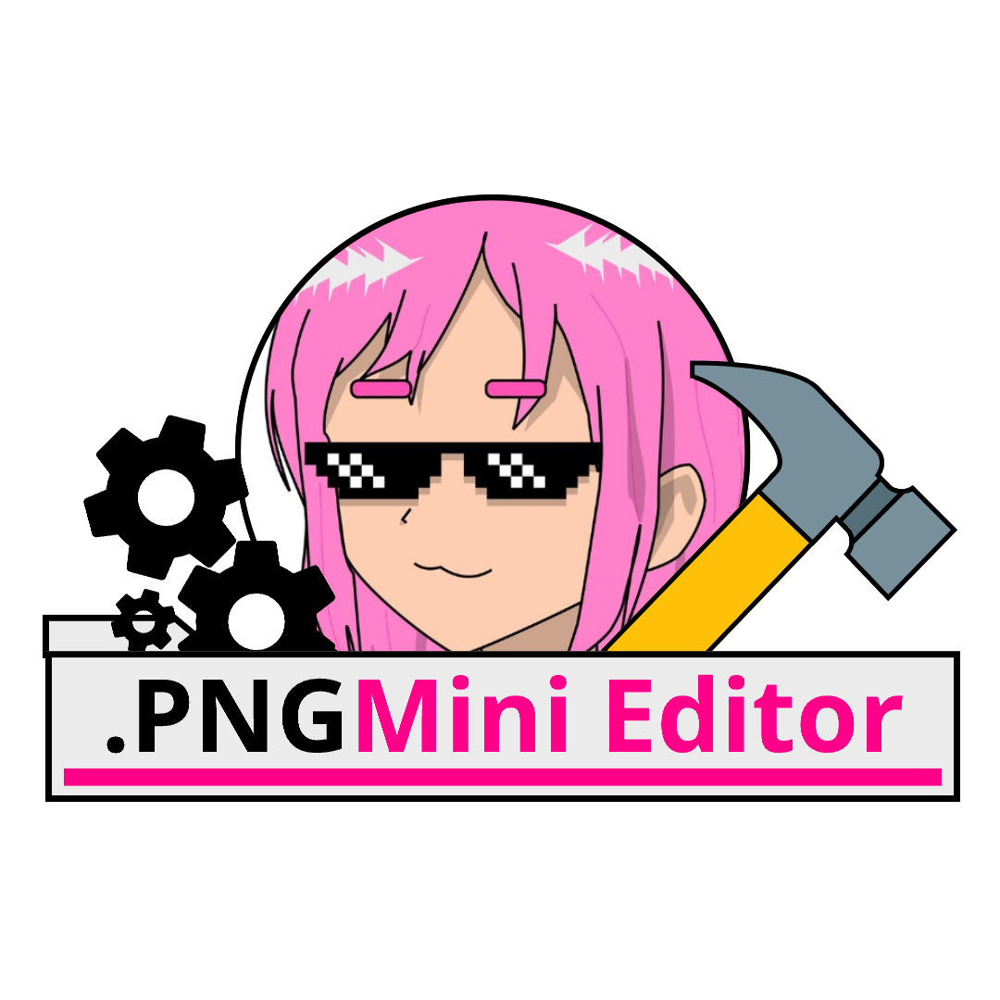

## PngtubeMini Editor

This program is the model packager for PngtubeStudio, if you want to start a model for the program, just download it, install it and create your models (subject to change as the main application is updated).

*This project was bootstrapped with [NodeJs](https://nodejs.org), [ElectronJs](https://www.electronjs.org) and [ReactJs](https://react.dev)*
*config by [Electron-Vite](https://electron-vite.org/)*

### **Available on [itch.io](https://pintogamer64.itch.io/pngtubemini-modeleditor)**

## Instalation

```bash
$ git clone https://github.com/PintoGamer64/PngtubeMiniProject.git
$ cd PngtubeMiniProject
$ npm install
```

### Development

```bash
$ npm run dev
or
$ bun run dev
```

### Build

```bash
# For windows
$ npm run build:win
```

